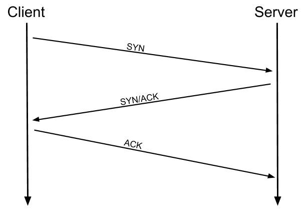

# TryHackMe

Content Management Systems (such as Wordpress, FuelCMS, Ghost, etc)

- (ExploitDB)[https://www.exploit-db.com/]
- (NVD)[https://nvd.nist.gov/vuln/search]
- (CVE Mitre)[https://cve.mitre.org/]

If you're inclined towards the CLI on Linux, Kali comes pre-installed with a tool called "searchsploit" which allows you to search ExploitDB from your own machine. This is offline, and works using a downloaded version of the database, meaning that you already have all of the exploits already on your Kali Linux!

`searchsploit fuel cms`

shiba1:shiba1
shiba2:pinguftw
shiba3:happynootnoises
shiba4:test1234

- <https://tryhackme.com/room/bpsplunk>
- <https://tryhackme.com/room/bpvolatility>

## OSI model

| layer| OSI | Description |
| ---- | ----| ----- |
| 7 | application | networking options to programs - interface for apps to use in order to transmit data - data is passed down to the presentation layer |
| 6 | presentation | translates the data into a standardised format - handles encryption, compression or other transformations data is passed to the session layer|
| 5 | session | it looks to see if it can set up a connection with the other computer across the network - this layer maintains the session - cooperate with the session layer of the remote computer in order to synchronise communications. the session is unique to the communication in question|
| 4 | transport | choose the protocol over which the data is to be transmitted, most commonly TCP (connection based, a connection between the computers is established and maintained for the duration of the request - ensures that _all_ the packets get to the right place - any data loss is re-sent) or UDP (speed). with a protocol selected, the transport layer then divides the transmission up into bite-sized pieces (in TCP called _segments_, over UDP _datagrams_) which makes it easier to transmit the message successfully |
| 3 | network | responsible for locating the destination of your request - this layer takes the IP address and figures out the best route to take - _logical_ addressing (IP addresses) which are software controlled.logical addresses are used to provide order to networks, categorising them and allowing us to properly sort them|
| 2 | data link | _physical_ addressing of the transmission. it receives a packet from the network layer (that includes the UP address for the remote computer) and adds in the physical (MAC) address of the receiving endpoint. inside every network enabled computer is a NIC which comes with a unique MAC address to identify it.MAC addresses are set by the manufacturer and literally burnt into the card; they can't be changed but it can be spoofed. __when information is sent across a network, it's actually the physical address that is used to identify where exactly to send the information__. this layer also has to present the data in a format suitable for transmission; when receiving transmission, it checks the received  information to make sure that it hasn't been corrupted during transmission|
| 1 | physical| hardware of the computer - electrical pulses that make up data transfer over a network are sent and received. it's the job of the physical layer to convert the binary data of the transmission into signas and trasmit them across the network, as well as receiving signals and converting them into binary data |

as the data is passed down each layer of the model, more information containing details specific to the layer in question is added on tho the start of the transmission - for instance, the header added by the network layer (L3) would include things like the source and destination IP addresses, and the header added by the transport layer (L4) info specific to the protocol being used. data link layer (2) adds information _at the end_ used to verify that the data has not been corrupted on transmission (increased security as the data can't be intercepted and tampered with without breaking the trailer). this processed is called **_encapsulation_**.

notice that the encapsuled data is given a different name at different setps of the process. when the message is received by the second computer, it reverses the process, which is called **de-encapsulation**.

## TCP/IP model

basis for real-world networking. four layers:

- Application
- Transport
- Internet
- Network interface

| OSI | tcp/ip |
| --- |----- |
| application | application |
| presentation | application |
| session | application |
| transport | transport |
| network | internet |
| data link | network interface |
| physical | network interface |

how data is sent across a network? protocols -- sets of rules that define how an action is to be carried out. tcp/ip takes tis name from the two most important of these: tcp that controls the flow of data between two endpoints and the internet protocol, which controls how packets are addressed and sent.

tcp is a connection-based protocol. before you send any data via TCP you must first form a stable connection between the two computers. the process of forming this connection is called the _three-way handshake_.

1. the computer first sends a special request to the remote server indicating that it wants to initialize a connection. this request contains something called a _SYN_ bit, which essentially makes first contact in starting the connection process.
2. the server will then respond with a packet containing the SYN bit, as well as another bit called _ACK_. the SYN/ACK.
3. finally your computer will send a packet that contains the ACK bit by itself, confirming that the connection ahs been setup successfully. three-way handshake successfully completed, data can be transmitted.

any data that is lost or corrupted on transmission is re-sent

- the three-way handshake must be carried out before a connection can be established using TCP

the ICMP protocol works on the network layer of the OSI model, and thus the internet layer of the TCP/IP model. `ping` can be used to determine the ip address of the server hosting a website.

the `traceroute` command can be used to map the path your request takes as it heads to the target machine. it allows you to see every intermediate step between your computer and the resource that you requested. windows equivalent is `tracert` and uses ICMP; traceroute on Linux uses UDP. our router is marked as `_gateway`

a domain translates into an IP address so that we don't need to remember the IP.

`whois` allows you to query who a domain name is registered to and information about it. `whois <domain>`.

a url gets converted into a IP address via a TCP/IP protocol called DNS. dns allows us to ask a special server to give us the IP address of the website we're trying to access

1. we make a request to a website. the first thing that your computer does is check its local cache to see if it's already got an IP address stored for the website; if it does, great. if not, it goes to the next stage of the process.
2. assuming the address hasn't already been found, your computer will then send a request to what's known as a _recursive_ DNS server. these will automatically be known to the router on your network. many ISPs maintain their own recursive servers. this is how your computer automatiaclly knows where to send the request for information: details for a recursive dns server are stored in your router. this server will also maintain a cache of results for popular domains; if the website we've requested is not stored in the cache, the recursive server will pass the request on to a _root name_ server.

the root name servers essentially keep track of the dns servers in the next level down, choosing an appropriate one to redirect your request to. these lower level servers are called _top-level domain_ (TLD) servers.

tld servers are split up into extensions. if you were searching for tryhackme**.com** your request would be redirected to a tld server that handled `.com` domains (for bbc.co.uk, a tld that handles `.co.uk`. 

as with root name servers, tld servers keep track of the next level down: _authoritative name servers_. when a tld server receives your request for information, the server passes it down to an appropriate authoritative name server.

authoritative name servers are used to store dns records for domains directly. in other words, every domain in the world will have its dns records on an authoritative name server somewhere or another; they are the source of the information. when your request reaches the authoritative name server for the domain you're querying, it will send the relevant information back to you, allowing your computer to connect to the IP address behind the domain you requested.

a browser does all of this automatically; we can do it manually using `dig`. it allows us to manually query recursive dns servers of our choice about domains: `dig <domain> @<dns-server-ip>` - `dig google.com @1.1.1.1`. relevant information:

- ANSWER SECTION: if _no errors_, it tells us that we sent one query and successfully received one full answer (containing the ip address of the domain name we queried)
- TTL time to live (second column). the ttls of the record tells your computer when to stop considering the record as being valid, when it should request the data again, rather than relying on the cached copy. measured in seconds.

Commands:

- ping
- traceroute
- whois
- dig

